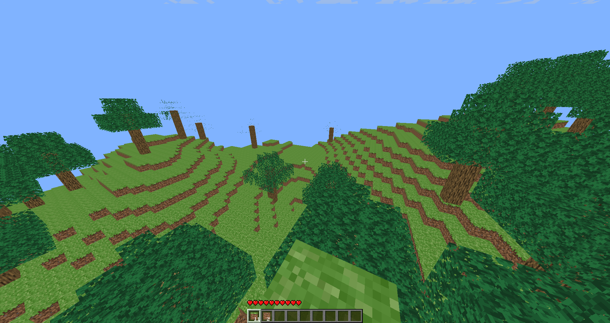

# Warning
This repo consists of a mess of code and should not be used as an example of building a 3D game on Python.

# Minecraft-Pygame
Simple 3d game with pyglet, pygame and pyopengl

# Libraries
pyopengl, pyglet, numpy, pygame

### Screenshots
* Loading screen

* Main menu

* Settings

* Game screenshots

